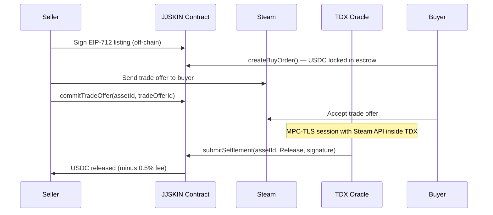
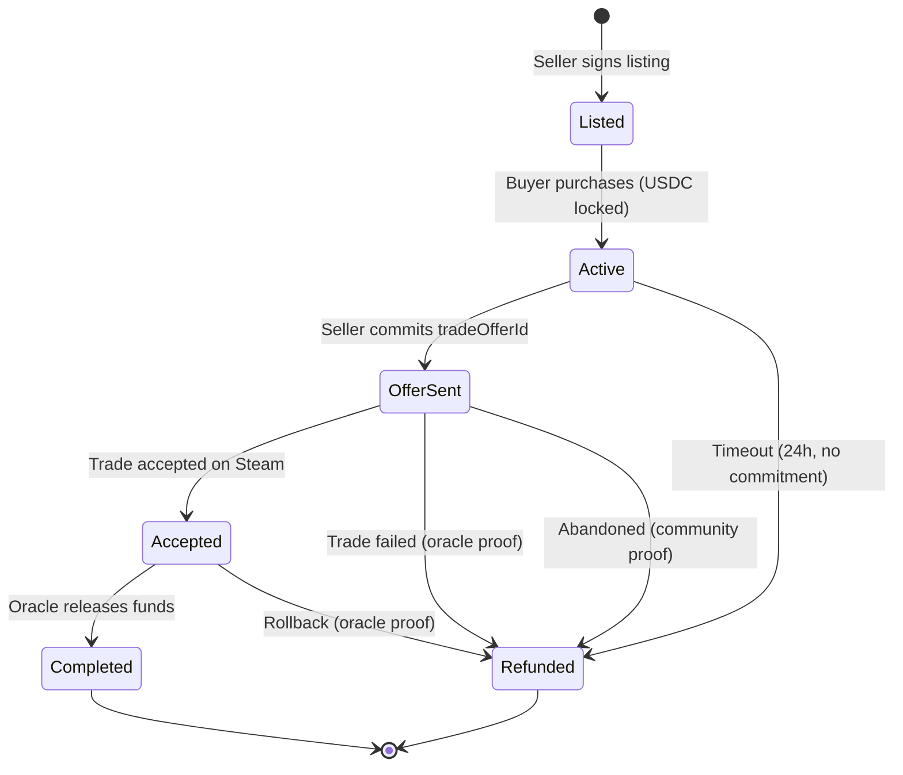

# How It Works

Every JJSKIN trade follows the same lifecycle: list, purchase, trade on Steam, oracle verifies, contract settles.

## Trade lifecycle



### Step by step

1. **Seller lists a skin** — Signs an EIP-712 listing message off-chain (no gas cost). The listing appears on jjskin.com.

2. **Buyer purchases** — Calls `createBuyOrder()` on the smart contract. USDC is locked in escrow. Neither party can move these funds without a valid oracle settlement.

3. **Seller sends Steam trade** — The seller sends a Steam trade offer containing the skin to the buyer, then calls `commitTradeOffer(assetId, tradeOfferId)` to commit the trade offer ID on-chain.

4. **Buyer accepts** — The buyer accepts the trade offer on Steam.

5. **Oracle verifies** — The TDX oracle runs a MPC-TLS session against Steam's API to verify the trade completed. It reads the trade status, verifies the asset ID, parties, and state, then signs an EIP-712 settlement message.

6. **Contract settles** — Anyone can submit the oracle's signed settlement to `submitSettlement()`. The contract verifies the oracle's signature and releases USDC to the seller (minus 0.5% fee).

## Oracle proof paths

The oracle has three ways to verify a trade, depending on what Steam API endpoint the prover connects to.

### 1. GetTradeOffer — Refund only

Used when a trade offer reaches a terminal failure state. This path can only produce refunds, never releases.

Terminal states:
- **State 5** — Expired (fault depends on who made the offer)
- **State 6** — Canceled (fault depends on who made the offer)
- **State 7** — Declined (fault depends on who declined)
- **State 8** — InvalidItems (item no longer valid)
- **State 10** — Canceled by 2FA (seller fault)

The oracle determines direction (who sent the offer) and assigns fault accordingly. For example, if the seller sent the offer and the buyer let it expire, that's buyer fault (`BuyerExpired`). If the buyer sent the offer and the seller declined, that's seller fault (`SellerDeclined`).

### 2. GetTradeStatus — Release + rollback refunds

Used after a trade has been accepted (State 3 in GetTradeOffer). This is the only path that can release funds.

**Release requires all of:**
- Status 3 (accepted)
- `asset_id_given` matches the escrowed asset
- `partner` matches the buyer's Steam ID
- `time_settlement` has passed (trade is finalized)

**Rollback refunds** for statuses 4-9, 11 (deprecated rollback) and status 12 (trade rollback).

### 3. Community HTML — Abandonment refund

Used when the seller commits a trade offer ID but the trade never appears or is abandoned. The prover loads the trade page on `steamcommunity.com` via MPC-TLS.

Requirements:
- Trade offer ID matches the committed ID
- Prover is either the buyer or seller
- `abandonedWindow` has elapsed since purchase (read from contract, default 24 hours)

### Timeout refund (no oracle needed)

If the seller never commits a trade offer within 24 hours, the buyer can call `claimTimeoutRefund(assetId)` directly on the contract — no oracle involvement required.

```solidity
// On-chain only: seller never committed a trade offer
if (block.timestamp > purchaseTime + abandonedWindow && tradeOfferId == 0) {
    // Buyer calls claimTimeoutRefund(assetId) → immediate refund
}
```

## Trade state machine



## Settlement signatures

The oracle signs EIP-712 typed data:

```
Settlement(uint64 assetId, uint48 tradeOfferId, uint8 decision, uint8 refundReason)
```

The contract verifies:
1. The signer is a registered oracle (`isOracle[signer] == true`)
2. The `assetId` has an active purchase
3. The settlement hasn't already been processed

This is a single signature per trade — no batching, no aggregation, no zkVM.
