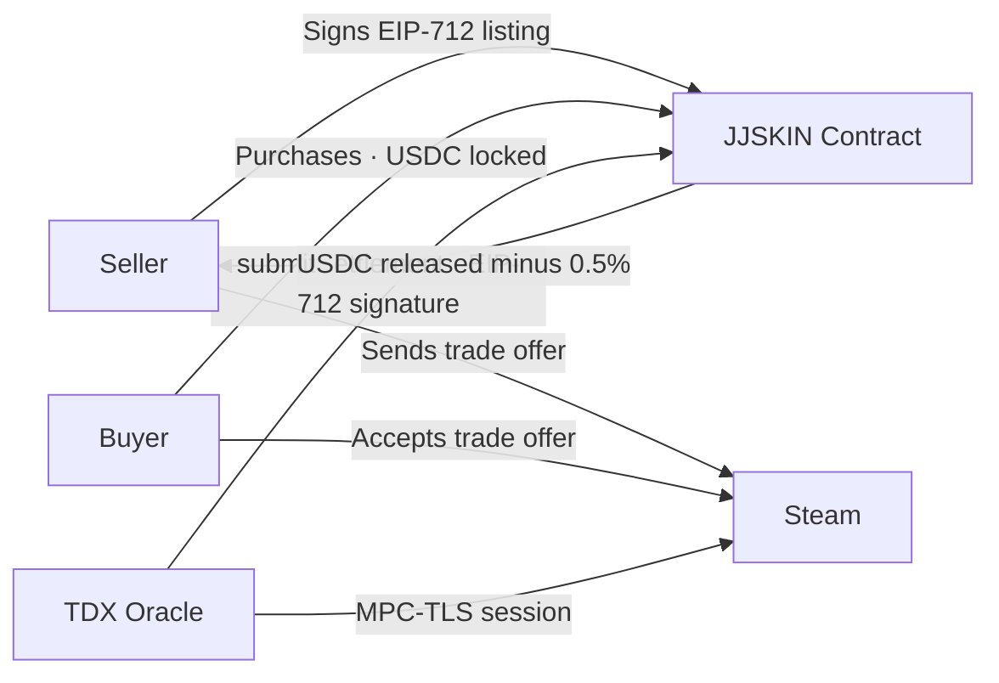

# JJSKIN

JJSKIN is a non-custodial CS2 skin marketplace on Arbitrum. Funds are held in a smart contract, and trades are settled by a cryptographic oracle running inside an Intel TDX confidential VM — not by a company clicking buttons.

## How it compares

| | Traditional marketplace | JJSKIN |
|---|---|---|
| **Fund custody** | Platform holds your money | Smart contract escrow on Arbitrum |
| **Settlement** | Platform decides outcome | TDX oracle with MPC-TLS proof |
| **Fees** | 10-15% | 0.5% (seller only) |
| **Verification** | "Trust us" | Open-source oracle, on-chain attestation |
| **Login** | Email/password | Steam OAuth (smart wallet created automatically) |
| **Gas fees** | N/A | Sponsored (you never pay gas) |

## Architecture overview

The oracle runs a TLSNotary MPC-TLS session with Steam's API inside an Intel TDX enclave. It verifies the trade outcome, signs an EIP-712 settlement message, and the smart contract releases or refunds funds based on that signature.

## Key numbers

| Metric | Value |
|---|---|
| Trading fee | 0.5% (paid by seller) |
| Currency | USDC on Arbitrum One |
| Gas fees | Sponsored (ERC-4337 smart wallets) |
| Login | Steam OAuth |
| Oracle | Intel TDX + MPC-TLS |
| Delivery window | 24 hours (configurable on-chain) |

<Cards>
  <Card title="How It Works" href="/docs/how-it-works">
    Full trade lifecycle — from listing to settlement
  </Card>
  <Card title="Security & Trust Model" href="/docs/security">
    TDX attestation, MPC-TLS, and what each party can and cannot do
  </Card>
  <Card title="Smart Contracts" href="/docs/contracts">
    Deployed contract addresses and key functions
  </Card>
</Cards>
