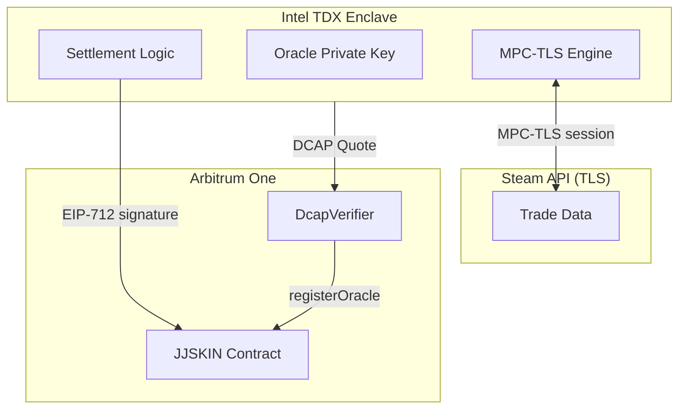

# Security & Trust Model

JJSKIN's security relies on multiple independent layers. No single component can steal funds or forge settlement outcomes.

## Trust layers

| Layer | Trust basis | What it proves |
|-------|-----------|----------------|
| **Intel TDX** | Silicon (hardware encryption) | Oracle private key never leaves encrypted memory |
| **DCAP Quote** | Intel-signed attestation | Exact binary (MRTD) and Docker image (RTMR[3]) running |
| **TLSNotary MPC-TLS** | Cryptographic protocol | Steam API response is genuine, not forged by oracle |
| **Smart Contract** | Arbitrum/Ethereum security | Only registered oracle can settle; funds only move with valid signature |
| **Reproducible Build** | Open-source code | Anyone can rebuild Docker image and verify MRTD matches |



## How MPC-TLS works

TLSNotary splits the TLS session between the prover (browser extension) and the verifier (oracle). Neither party can forge data alone:

1. **TLS handshake** — The prover connects to Steam's API. The oracle participates as MPC co-signer in the TLS handshake.
2. **Data exchange** — Steam sends encrypted trade data. Both parties collaborate to decrypt it via MPC — the oracle sees the plaintext response but cannot modify it.
3. **Verification** — The oracle verifies the decrypted response against on-chain escrow data and produces a settlement decision.

The oracle never sees the prover's Steam credentials. The prover cannot forge Steam's response because the oracle co-signed the TLS session.

## What each party can and cannot do

### The Oracle

| Can do | Cannot do |
|--------|-----------|
| Verify trade outcomes from Steam | Access user Steam credentials |
| Sign settlement messages | Move funds without valid trade data |
| Refuse to settle (DoS) | Forge Steam API responses (MPC prevents this) |
| | Extract its own private key (TDX prevents this) |

### Phala Network (hosting provider)

| Can do | Cannot do |
|--------|-----------|
| Shut down the VM (denial of service) | Read the oracle's private key |
| Restart the VM | Modify the running code without changing MRTD |
| See encrypted network traffic | Decrypt TLS sessions or forge settlements |

### JJSKIN (the company)

| Can do | Cannot do |
|--------|-----------|
| Deploy new oracle versions | Access escrowed funds directly |
| Register/revoke oracles (owner) | Forge oracle signatures |
| Update platform fee (capped) | Settle trades without oracle proof |
| Pause the contract (emergency) | Unpause without timelock |

## How to verify the oracle

Anyone can verify the oracle is running the published open-source code:

### 1. Get the DCAP attestation quote

```bash
curl -s https://3f351d27b464ed7779351cae4b7c548b0ee648c7-7047.dstack-pha-prod5.phala.network/attestation -o quote.bin
```

### 2. Upload to proof.t16z.com

Upload the binary `quote.bin` file (not hex) to [proof.t16z.com](https://proof.t16z.com). It will show **VERIFIED** with the MRTD and RTMR measurements.

### 3. Verify the oracle address

The oracle's Ethereum address is embedded in the DCAP quote's REPORTDATA field (first 20 bytes at offset 568):

```bash
python3 -c "
with open('quote.bin', 'rb') as f:
    data = f.read()
reportdata = data[568 : 568+64]
print(f'Oracle address: 0x{reportdata[:20].hex()}')
"
```

### 4. Reproduce the build

```bash
git clone https://github.com/lumio-it/jjskin-oracle
cd jjskin-oracle
GIT_HASH=$(git rev-parse --short HEAD)
docker build --platform linux/amd64 -f Dockerfile.tdx --build-arg GIT_HASH=$GIT_HASH -t jjskin-oracle .
```

The resulting image's MRTD should match the one in the DCAP quote.

## Known limitations

We believe in being transparent about trust assumptions:

- **Single oracle** — There is currently one oracle instance. If it goes down, trades cannot be settled (but funds remain safe in escrow). This is a liveness risk, not a safety risk.

- **`registerOracleDirect()` fallback** — The oracle is registered via an owner-only function, not via on-chain DCAP verification. On-chain DCAP via Automata requires $299/month collateral that isn't set up yet. Verification relies on off-chain DCAP checks at [proof.t16z.com](https://proof.t16z.com).

- **Steam API dependency** — Settlement depends on Steam's API being available and returning accurate data. If Steam is down, settlements are delayed (not lost).

- **Owner privileges** — The contract owner can register/revoke oracles, update fee parameters, and pause the contract. These are standard safety mechanisms but represent a trust assumption on the deployer.

## TDX measurement details

| Field | Description |
|-------|-------------|
| **MRTD** | Hash of the TDX VM binary — changes when oracle code changes |
| **RTMR[3]** | Hash of the Docker Compose file — changes when the image digest changes |
| **REPORTDATA** | Oracle's Ethereum address (first 20 bytes) |

On-chain measurements are stored on the DcapVerifier contract (`0x4D455ceA16E65c7566105caDEAd68851625BD8a9`):
- `activeMeasurement` = `keccak256(MRTD)`
- `activeRtmr3` = `keccak256(RTMR3)`

These can be verified by anyone to confirm the on-chain registered oracle matches the attested code.
